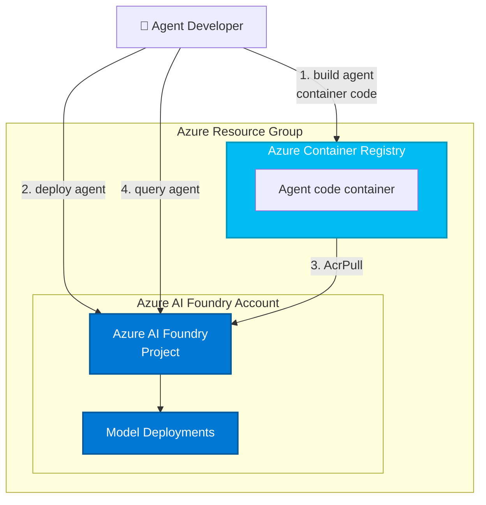

# Contoso Customer Support Agent - Azure Foundry Hosted Agent Example

This repository contains a **production-ready example** of an Azure Foundry Hosted Agent integrated with a custom MCP (Model Context Protocol) service. It demonstrates how to build, deploy, and manage AI agents that have real-time access to business data through a containerized MCP service.

⚠️ **IMPORTANT**: This is a template with placeholder values for Azure resources. You **MUST** replace these with your own values before deployment. See [Configuration](#-configuration) section below.

## 🎯 Overview

This project showcases a complete implementation of:

- **Azure Foundry Hosted Agent Service**: Microsoft's managed service for deploying AI agents
- **Custom MCP Service**: A Model Context Protocol server running in Azure Container Apps with business tools
- **Data Integration**: SQLite database with customer data accessible through MCP tools
- **Infrastructure as Code**: Complete Bicep templates for one-click Azure deployment

### What Makes This Different

Unlike basic hosted agent examples, this implementation separates concerns and provides:

1. **Standalone MCP Service** - Hosted independently in Azure Container Apps
2. **Real Business Logic** - Example tools for customer data, billing, orders, subscriptions
3. **Data Persistence** - SQLite database accessible through MCP
4. **Production Architecture** - Monitoring, logging, and security built-in
5. **Clone-and-Customize** - Designed for customers to fork and adapt to their needs

## 📊 Architecture

```
┌─────────────────────────────────────────────────────────────┐
│                  Azure Foundry Project                      │
│  ┌──────────────────────────────────────────────────────┐   │
│  │     Hosted Agent (contoso-support-agent)            │   │
│  │  • agent.yaml: Agent configuration                  │   │
│  │  • main.py: Agent orchestration & LLM integration  │   │
│  │  • Runs in: Azure Container Apps                   │   │
│  └────────────────────┬─────────────────────────────────┘   │
│                       │                                      │
│                       │ HTTP (MCPStreamableHTTPTool)        │
│                       ▼                                      │
│  ┌──────────────────────────────────────────────────────┐   │
│  │     Custom MCP Service (custom-mcp)                 │   │
│  │  • mcp_service.py: FastMCP server                   │   │
│  │  • contoso_tools.py: Business-specific tools        │   │
│  │  • data/contoso.db: Customer data store             │   │
│  │  • Runs in: Azure Container Apps                   │   │
│  └──────────────────────────────────────────────────────┘   │
└─────────────────────────────────────────────────────────────┘

Additional Azure Resources (via Bicep):
• Azure Container Registry (ACR)
• Application Insights (Monitoring)
• Log Analytics Workspace (Logging)
• Azure AI Search (Optional)
```

## 🚀 Quick Start

See [QUICKSTART.md](QUICKSTART.md) for detailed setup instructions.

### 30-Second Overview

```bash
# 1. Clone this repository
git clone <this-repo> my-custom-agent
cd my-custom-agent

# 2. Install prerequisites
# - Azure Developer CLI (azd): https://aka.ms/install-azd
# - Azure CLI: https://aka.ms/azcli
# - Docker (for local testing)

# 3. Deploy to Azure
azd auth login
azd up

# 4. Test in Azure Foundry portal
# Navigate to https://ai.azure.com and interact with your agent
```

## 📁 Project Structure

```
Hosted_Agents/
├── README.md                          # This file
├── QUICKSTART.md                      # Setup and deployment guide
├── .env.example                       # Configuration template
├── azure.yaml                         # Azure Foundry project manifest
│
├── contoso-support-agent/             # ← HOSTED AGENT
│   ├── agent.yaml                     # Agent configuration for Foundry
│   ├── main.py                        # Agent logic (customize here)
│   ├── Dockerfile                     # Container definition
│   └── requirements.txt               # Python dependencies
│
├── custom-mcp/                        # ← CUSTOM MCP SERVICE
│   ├── mcp_service.py                 # MCP server (FastMCP)
│   ├── contoso_tools.py               # Tool implementations (customize here)
│   ├── data/
│   │   └── contoso.db                 # SQLite database (replace with your data)
│   ├── Dockerfile                     # Container definition
│   ├── requirements.txt               # Python dependencies
│   └── .env.example                   # MCP-specific configuration
│
└── infra/                             # ← INFRASTRUCTURE AS CODE
    ├── main.bicep                     # Main orchestration template
    ├── main.parameters.json           # Parameter values
    ├── abbreviations.json             # Resource naming conventions
    └── core/                          # Modular templates
        ├── ai/                        # AI Foundry resources
        ├── host/                      # Container hosting (ACR, Container Apps)
        ├── monitor/                   # Monitoring (App Insights, Log Analytics)
        ├── search/                    # Search resources (optional)
        └── storage/                   # Storage resources
```

## � Configuration & Placeholder Values

### ⚠️ Critical: Replace Template Values

This repository contains **placeholder values** that MUST be replaced with your own. Do NOT deploy with placeholders.

**Placeholder Values to Replace:**

| File | Placeholder | Where to Find Your Value |
|------|-------------|--------------------------|
| `.env.example` | `<your-subscription-id>` | Azure Portal > Subscriptions |
| `.env.example` | `<your-mcp-service-url>` | After `azd up` completes, shown in terminal |
| `contoso-support-agent/main.py` | `<your-mcp-service-url>` | Same as above |
| `.env.example` | `<your-mcp-service-base-url>` | MCP service URL without `/mcp` suffix |

### How to Get Your MCP Service URL

After running `azd up`, the deployment will display:
```
MCP Service deployed at:
https://contoso-mcp-<random>.northcentralus.azurecontainerapps.io
```

Copy this URL and:
1. Update `.env` file: Set `MCP_SERVICE_URL=https://your-url-here/mcp`
2. Update `contoso-support-agent/main.py`: Replace the placeholder with the actual URL
3. Redeploy with: `azd up`

### Environment Variables Required

```bash
# Copy and fill in your values
cp .env.example .env

# Edit .env and replace:
AZURE_SUBSCRIPTION_ID=your-actual-subscription-id
AZURE_RESOURCE_GROUP=your-actual-resource-group
AZURE_LOCATION=northcentralus

# After deployment, also update:
MCP_SERVICE_URL=your-actual-mcp-url/mcp
```

## 🔧 Customization Guide

### For Your First Deployment
Follow [QUICKSTART.md](QUICKSTART.md) to deploy the example as-is. This will:
- Create an Azure Foundry project
- Deploy the example agent and MCP service
- Show you the actual service URLs in the output
- You'll then update placeholders with these real URLs

### To Customize for Your Use Case

#### 1. Update Agent Instructions
**File**: `contoso-support-agent/main.py`

Look for the `# ===== CUSTOMIZE:` comments and update:

```python
instructions=(
    "You are a helpful customer service assistant for YOUR_COMPANY. "
    "You have access to [describe your data/tools]. "
    "Help customers with [describe your domain]."
),
```

#### 2. Implement Your Tools
**File**: `custom-mcp/contoso_tools.py`

Look for the `# ===== REPLACE:` comments and replace the example tools with your business logic:

```python
# ===== REPLACE THIS FILE FOR YOUR USE CASE =====
# This example shows customer support tools
# Implement your own tools using FastMCP
```

Replace the example tools with your business logic:
```python
# Example: Replace customer_lookup with your API
async def customer_lookup(customer_id: int):
    """Replace this with your database query or API call"""
    # Instead of SQLite, call your system
```

#### 3. Use Your Data
**File**: `custom-mcp/data/contoso.db`

Replace the example SQLite database with your data source:
- Dump your data into SQLite, OR
- Modify `contoso_tools.py` to connect to your database
- Update connection strings in `.env` files

#### 4. Configure Azure Resources
**File**: `infra/main.parameters.json`

Update resource names, regions, and SKUs to match your Azure subscription and requirements.

## 🛠 Development

### Local Testing (Before Azure Deployment)

**Start MCP Service Locally**:
```bash
cd custom-mcp
python -m pip install -r requirements.txt
python mcp_service.py
# Runs on http://localhost:8000
```

**In Another Terminal - Start Agent**:
```bash
cd contoso-support-agent
python -m pip install -r requirements.txt

# Set environment variables
export AZURE_AI_PROJECT_ENDPOINT=http://localhost:8080  # Mock for testing
export AZURE_AI_MODEL_DEPLOYMENT_NAME=gpt-4o-mini
export MCP_SERVICE_URL=http://localhost:8000/mcp

python main.py
```

### Environment Variables

See `.env.example` and `custom-mcp/.env.example` for all configuration options.

Key variables:
- `AZURE_SUBSCRIPTION_ID`: Your Azure subscription
- `AZURE_AI_PROJECT_ENDPOINT`: Foundry project endpoint (set during deployment)
- `AZURE_AI_MODEL_DEPLOYMENT_NAME`: LLM model to use (default: gpt-4o-mini)
- `MCP_SERVICE_URL`: URL to your MCP service endpoint
- `DISABLE_AUTH`: Set to `true` for local testing

## 📚 How It Works

### Agent Flow

1. **User Query** → Foundry Portal sends prompt to hosted agent
2. **Agent Processing** → `main.py` receives query via Azure Agent Framework
3. **Tool Selection** → LLM decides which MCP tools to call
4. **MCP Call** → Agent calls custom MCP service via HTTP
5. **Tool Execution** → MCP service runs `contoso_tools.py` functions
6. **Database Query** → Tools query `contoso.db` for data
7. **Response** → MCP returns data to agent
8. **Answer Generation** → LLM generates response using tool data
9. **Response** → Answer sent back to user in Foundry Portal

### Key Components

**Agent (contoso-support-agent/main.py)**
- Uses Azure AI Agent Framework
- Connects to LLM (GPT-4o-mini)
- Calls MCP tools via `MCPStreamableHTTPTool`
- Handles conversation context

**MCP Service (custom-mcp/mcp_service.py)**
- FastMCP server exposing tools via HTTP endpoint
- Authentication & authorization
- Logging and monitoring

**Tools (custom-mcp/contoso_tools.py)**
- Business logic functions
- Database queries
- External API calls
- Data transformation

**Data (custom-mcp/data/contoso.db)**
- SQLite database
- Customer profiles, billing, orders, subscriptions
- Replace with your data

## 🔐 Security Considerations

This is a **reference implementation**. Before production:

- [ ] Enable MCP authentication (see `custom-mcp/.env.example`)
- [ ] Use managed identity for Azure service-to-service auth
- [ ] Implement API rate limiting
- [ ] Enable monitoring/alerting (App Insights)
- [ ] Use Key Vault for secrets
- [ ] Implement audit logging
- [ ] Validate all user inputs
- [ ] Use private endpoints for network isolation

## 📖 Learning Resources

- [Azure Foundry Documentation](https://aka.ms/azure-ai-foundry)
- [Hosted Agents Preview](https://learn.microsoft.com/en-us/azure/ai-foundry/concepts/agents)
- [Model Context Protocol (MCP)](https://modelcontextprotocol.io/)
- [Azure Developer CLI (azd)](https://learn.microsoft.com/en-us/azure/developer/azure-developer-cli/)
- [Reference Workshop](https://github.com/hatasaki/hosted-agent-workshop)

## 📝 What's Different from the Workshop

The [hosted-agent-workshop](https://github.com/hatasaki/hosted-agent-workshop) provides a basic starter template. This project builds upon that by adding:

| Aspect | Workshop | This Project |
|--------|----------|--------------|
| MCP Integration | Uses external service (Microsoft Learn) | Custom MCP you own & control |
| Data Storage | Read-only reference data | Persistent SQLite database |
| Business Logic | Generic examples | Domain-specific tools |
| Deployment | Basic infrastructure | Complete Bicep templates |
| Customization Path | Starting point | Clone-and-customize ready |
| Real Use Case | Educational | Contoso customer support |

## 🤝 Contributing

Found an issue? Want to improve the example? 

1. Fork this repository
2. Create a feature branch
3. Make your changes
4. Submit a pull request

## 📄 License

This project is licensed under the MIT License - see [LICENSE.md](LICENSE.md).

## ⚠️ Disclaimer

This code is provided as-is for educational and reference purposes. It is not recommended to use this code in production without:

- Comprehensive security review
- Authentication implementation
- Proper monitoring and alerting
- Compliance assessment for your industry
- Data protection measures

The authors are not responsible for any issues or damages arising from the use of this code.

## 🆘 Support

- 📖 Read [QUICKSTART.md](QUICKSTART.md) for setup help
- 🔍 Check Azure Foundry docs
- 💬 Open an issue on GitHub

---

**Last Updated**: January 2, 2026  
**Status**: Preview  
**Maintained By**: Microsoft OpenAI Workshop Team

This template, the application code and configuration it contains, has been built to showcase Microsoft Azure specific services and tools. We strongly advise our customers not to make this code part of their production environments without implementing or enabling additional security features.

With any AI solutions you create using these templates, you are responsible for assessing all associated risks, and for complying with all applicable laws and safety standards. Learn more in the transparency documents for [Agent Service](https://learn.microsoft.com/en-us/azure/ai-foundry/responsible-ai/agents/transparency-note) and [Agent Framework](https://github.com/microsoft/agent-framework/blob/main/TRANSPARENCY_FAQ.md).

## Features

This project framework provides the following features:

* **Microsoft Foundry Project**: Complete setup of Microsoft Foundry workspace with project configuration
* **Foundry Model Deployments**: Automatic deployment of AI models for agent capabilities
* **Azure Container Registry**: Container image storage and management for agent deployments
* **Managed Identity**: Built-in Azure Managed Identity for keyless authentication between services

### Architecture Diagram

This starter kit will provision the bare minimum for your hosted agent to work (if `ENABLE_HOSTED_AGENTS=true`).

| Resource | Description |
|----------|-------------|
| [Microsoft Foundry](https://learn.microsoft.com/azure/ai-foundry) | Provides a collaborative workspace for AI development with access to models, data, and compute resources |
| [Azure Container Registry](https://learn.microsoft.com/azure/container-registry/) | Stores and manages container images for secure deployment |
| [Application Insights](https://learn.microsoft.com/azure/azure-monitor/app/app-insights-overview) | *Optional* - Provides application performance monitoring, logging, and telemetry for debugging and optimization |
| [Log Analytics Workspace](https://learn.microsoft.com/azure/azure-monitor/logs/log-analytics-workspace-overview) | *Optional* - Collects and analyzes telemetry data for monitoring and troubleshooting |

Those resources will be used by the [`azd ai agent` extension](https://aka.ms/azdaiagent/docs) when building and deploying agents:



The template is parametrized so that it can be configured with additional resources depending on the agent requirements:

* deploy AI models by setting `AI_PROJECT_DEPLOYMENTS` with a list of model deployment configs,
* provision additional resources (Azure AI Search, Bing Search) by setting `AI_PROJECT_DEPENDENT_RESOURCES`,
* enable monitoring by setting `ENABLE_MONITORING=true` (default on),
* provision connections by setting `AI_PROJECT_CONNECTIONS` with a list of connection configs.

## Getting Started

Note: this repository is not meant to be cloned, but to be consumed as a template in your own project:

```bash
azd init --template Azure-Samples/ai-foundry-starter-basic
```

### Prerequisites

* Install [azd](https://aka.ms/install-azd)
  * Windows: `winget install microsoft.azd`
  * Linux: `curl -fsSL https://aka.ms/install-azd.sh | bash`
  * MacOS: `brew tap azure/azd && brew install azd`

### Quickstart

1. Bring down the template code:

    ```shell
    azd init --template Azure-Samples/ai-foundry-starter-basic
    ```

    This will perform a git clone

2. Sign into your Azure account:

    ```shell
    azd auth login
    ```

3. Download a sample agent from GitHub:

    ```shell
    azd ai agent init -m <repo-path-to-agent.yaml>
    ```

You'll find agent samples in the [`foundry-samples` repo](https://github.com/azure-ai-foundry/foundry-samples/tree/main/samples/microsoft/python/getting-started-agents/hosted-agents).

## Guidance

### Region Availability

This template does not use specific models. The model deployments are a parameter of the template. Each model may not be available in all Azure regions. Check for [up-to-date region availability of Microsoft Foundry](https://learn.microsoft.com/en-us/azure/ai-foundry/reference/region-support) and in particular the [Agent Service](https://learn.microsoft.com/en-us/azure/ai-foundry/agents/concepts/model-region-support?tabs=global-standard).

## Resource Clean-up

To prevent incurring unnecessary charges, it's important to clean up your Azure resources after completing your work with the application.

- **When to Clean Up:**
  - After you have finished testing or demonstrating the application.
  - If the application is no longer needed or you have transitioned to a different project or environment.
  - When you have completed development and are ready to decommission the application.

- **Deleting Resources:**
  To delete all associated resources and shut down the application, execute the following command:
  
    ```bash
    azd down
    ```

    Please note that this process may take up to 20 minutes to complete.

⚠️ Alternatively, you can delete the resource group directly from the Azure Portal to clean up resources.

### Costs

Pricing varies per region and usage, so it isn't possible to predict exact costs for your usage.
The majority of the Azure resources used in this infrastructure are on usage-based pricing tiers.

You can try the [Azure pricing calculator](https://azure.microsoft.com/pricing/calculator) for the resources deployed in this template.

* **Microsoft Foundry**: Standard tier. [Pricing](https://azure.microsoft.com/pricing/details/ai-foundry/)
* **Azure AI Services**: S0 tier, defaults to gpt-4o-mini. Pricing is based on token count. [Pricing](https://azure.microsoft.com/pricing/details/cognitive-services/)
* **Azure Container Registry**: Basic SKU. Price is per day and on storage. [Pricing](https://azure.microsoft.com/en-us/pricing/details/container-registry/)
* **Azure Storage Account**: Standard tier, LRS. Pricing is based on storage and operations. [Pricing](https://azure.microsoft.com/pricing/details/storage/blobs/)
* **Log analytics**: Pay-as-you-go tier. Costs based on data ingested. [Pricing](https://azure.microsoft.com/pricing/details/monitor/)
* **Azure AI Search**: Basic tier, LRS. Price is per day and based on transactions. [Pricing](https://azure.microsoft.com/en-us/pricing/details/search/)
* **Grounding with Bing Search**: G1 tier. Costs based on transactions. [Pricing](https://www.microsoft.com/en-us/bing/apis/grounding-pricing)

⚠️ To avoid unnecessary costs, remember to take down your app if it's no longer in use, either by deleting the resource group in the Portal or running `azd down`.

### Security guidelines

This template also uses [Managed Identity](https://learn.microsoft.com/entra/identity/managed-identities-azure-resources/overview) for local development and deployment.

To ensure continued best practices in your own repository, we recommend that anyone creating solutions based on our templates ensure that the [Github secret scanning](https://docs.github.com/code-security/secret-scanning/about-secret-scanning) setting is enabled.

You may want to consider additional security measures, such as:

- Enabling Microsoft Defender for Cloud to [secure your Azure resources](https://learn.microsoft.com/azure/defender-for-cloud/).
- Protecting the Azure Container Apps instance with a [firewall](https://learn.microsoft.com/azure/container-apps/waf-app-gateway) and/or [Virtual Network](https://learn.microsoft.com/azure/container-apps/networking?tabs=workload-profiles-env%2Cazure-cli).

> **Important Security Notice** <br/>
This template, the application code and configuration it contains, has been built to showcase Microsoft Azure specific services and tools. We strongly advise our customers not to make this code part of their production environments without implementing or enabling additional security features.  <br/><br/>
For a more comprehensive list of best practices and security recommendations for Intelligent Applications, [visit our official documentation](https://learn.microsoft.com/en-us/azure/ai-foundry/).

## Additional Disclaimers

**Trademarks** This project may contain trademarks or logos for projects, products, or services. Authorized use of Microsoft trademarks or logos is subject to and must follow [Microsoft’s Trademark & Brand Guidelines](https://www.microsoft.com/en-us/legal/intellectualproperty/trademarks/usage/general). Use of Microsoft trademarks or logos in modified versions of this project must not cause confusion or imply Microsoft sponsorship. Any use of third-party trademarks or logos are subject to those third-party’s policies.

To the extent that the Software includes components or code used in or derived from Microsoft products or services, including without limitation Microsoft Azure Services (collectively, “Microsoft Products and Services”), you must also comply with the Product Terms applicable to such Microsoft Products and Services. You acknowledge and agree that the license governing the Software does not grant you a license or other right to use Microsoft Products and Services. Nothing in the license or this ReadMe file will serve to supersede, amend, terminate or modify any terms in the Product Terms for any Microsoft Products and Services.

You must also comply with all domestic and international export laws and regulations that apply to the Software, which include restrictions on destinations, end users, and end use. For further information on export restrictions, visit <https://aka.ms/exporting>.

You acknowledge that the Software and Microsoft Products and Services (1) are not designed, intended or made available as a medical device(s), and (2) are not designed or intended to be a substitute for professional medical advice, diagnosis, treatment, or judgment and should not be used to replace or as a substitute for professional medical advice, diagnosis, treatment, or judgment. Customer is solely responsible for displaying and/or obtaining appropriate consents, warnings, disclaimers, and acknowledgements to end users of Customer’s implementation of the Online Services.

You acknowledge the Software is not subject to SOC 1 and SOC 2 compliance audits. No Microsoft technology, nor any of its component technologies, including the Software, is intended or made available as a substitute for the professional advice, opinion, or judgement of a certified financial services professional. Do not use the Software to replace, substitute, or provide professional financial advice or judgment.  

BY ACCESSING OR USING THE SOFTWARE, YOU ACKNOWLEDGE THAT THE SOFTWARE IS NOT DESIGNED OR INTENDED TO SUPPORT ANY USE IN WHICH A SERVICE INTERRUPTION, DEFECT, ERROR, OR OTHER FAILURE OF THE SOFTWARE COULD RESULT IN THE DEATH OR SERIOUS BODILY INJURY OF ANY PERSON OR IN PHYSICAL OR ENVIRONMENTAL DAMAGE (COLLECTIVELY, “HIGH-RISK USE”), AND THAT YOU WILL ENSURE THAT, IN THE EVENT OF ANY INTERRUPTION, DEFECT, ERROR, OR OTHER FAILURE OF THE SOFTWARE, THE SAFETY OF PEOPLE, PROPERTY, AND THE ENVIRONMENT ARE NOT REDUCED BELOW A LEVEL THAT IS REASONABLY, APPROPRIATE, AND LEGAL, WHETHER IN GENERAL OR IN A SPECIFIC INDUSTRY. BY ACCESSING THE SOFTWARE, YOU FURTHER ACKNOWLEDGE THAT YOUR HIGH-RISK USE OF THE SOFTWARE IS AT YOUR OWN RISK.
