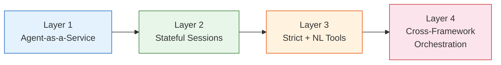
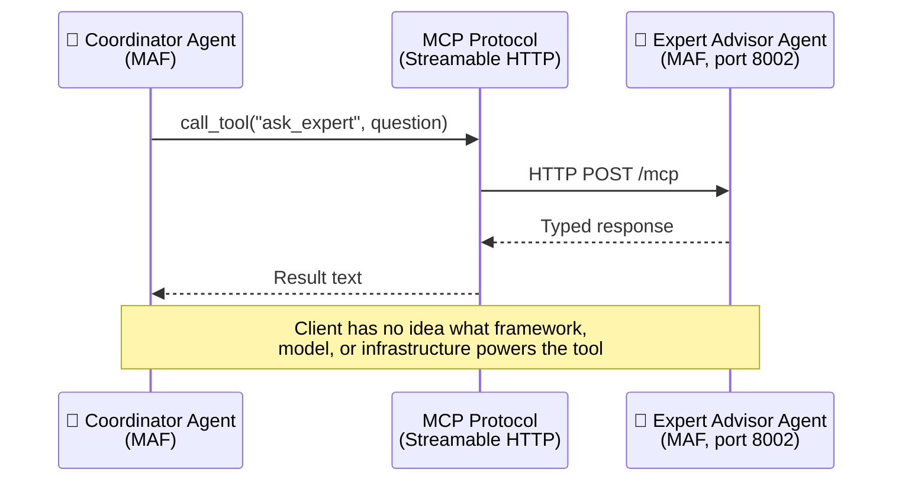
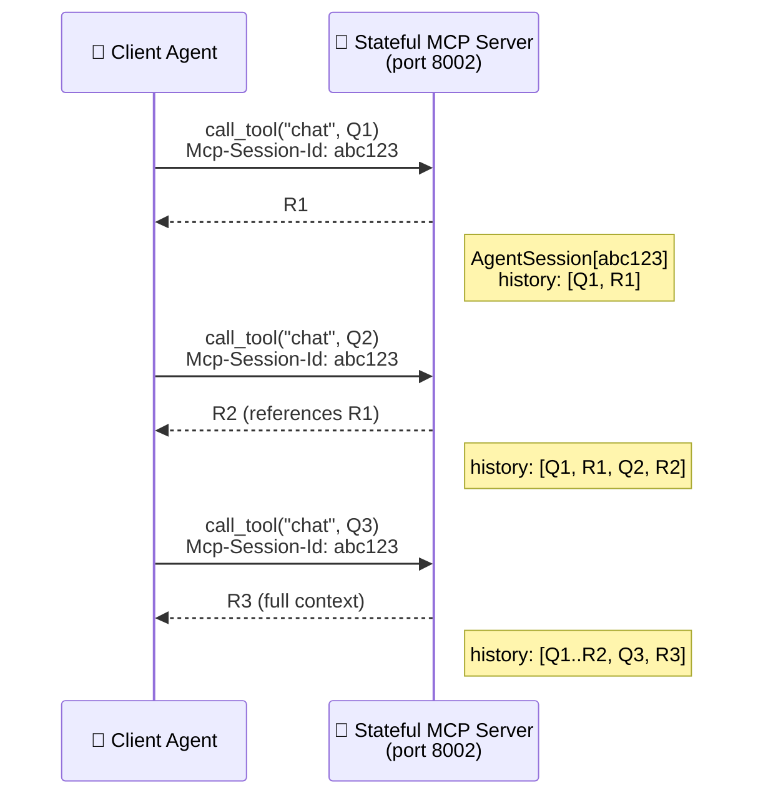
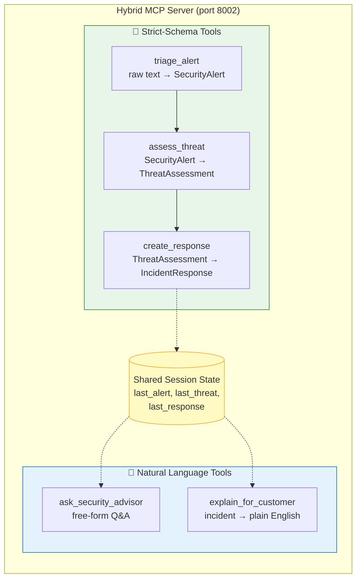
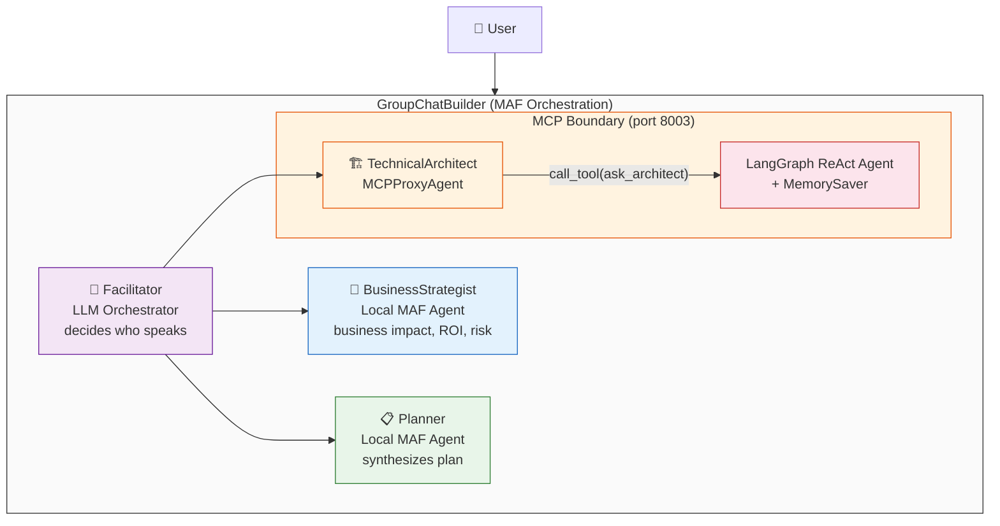
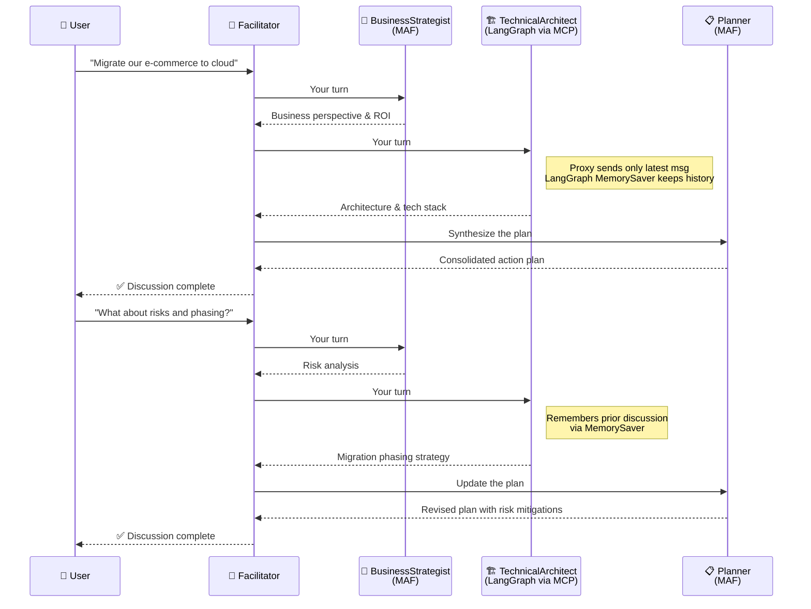
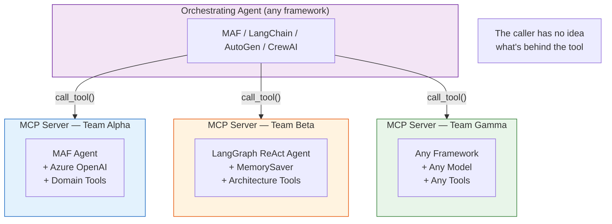

# MCP as the Universal Agent Interop Layer

> Have teams expose their agentic capabilities as MCP tool servers.
> Behind each tool? Whatever they want — multi-agent workflows, RAG
> pipelines, LLM reasoning chains, or agents built with entirely
> different frameworks. The caller doesn't know or care.

This demo progressively proves that **MCP can serve as the universal
interop layer** between AI agents — across frameworks, across machines,
across multi-turn conversations.

## Why MCP for Agent-to-Agent Communication?

The MCP specification now covers virtually every capability needed for
agent-to-agent communication:

| Capability | MCP | A2A |
|---|---|---|
| Stateful sessions | ✅ `Mcp-Session-Id` | ✅ |
| Streaming | ✅ SSE | ✅ SSE |
| Long-running tasks (polling, cancellation, TTL) | ✅ | ✅ |
| Mid-task user input (elicitation) | ✅ | ❌ |
| OAuth 2.1 + OIDC auth | ✅ | ✅ |
| Structured input/output schemas | ✅ | ✅ |
| Ecosystem adoption | 🟢 Every major LLM platform | 🟡 Growing |

When an agent calls another agent via A2A, the LLM still sees it as a
tool call. A2A wraps it in "agent identity" semantics. MCP keeps it as
what it actually is — **a tool with typed I/O**. Less abstraction, less
complexity, same result.

**Where MCP wins:**
- Massive ecosystem — every major LLM platform speaks MCP
- Typed contracts between teams — no "interpret my natural language" ambiguity
- Simpler mental model — teams expose tools, done

**Where A2A still makes sense:**
- Cross-organizational federation with unknown third parties
- When you truly can't define schemas upfront

## What This Demo Proves

Each layer adds one capability, building to a cross-framework
multi-agent orchestration where the MCP boundary is invisible.



---

### Layer 1: Agent-as-a-Service (Scripts 1–2)

> Any agent can be exposed as an MCP tool server. Any other agent can
> consume it. The caller doesn't know what's behind the tool.



| Script | Role | Description |
|---|---|---|
| `mcp_server.py` | Server | MAF Agent with domain tools exposed as MCP endpoint on port 8002 |
| `mcp_client_agent.py` | Client | Coordinator agent that delegates to the remote agent via MCP |

---

### Layer 2: Stateful Sessions (Scripts 3–4)

> MCP sessions (`Mcp-Session-Id`) enable multi-turn conversations with
> remote agents. The server remembers context — no client-side history needed.



| Script | Role | Description |
|---|---|---|
| `mcp_server_stateful.py` | Server | Each MCP session → own `AgentSession` with accumulated history |
| `mcp_client_stateful.py` | Client | 3-turn conversation: risks → market data → executive summary |

---

### Layer 3: Strict + Natural Language Tools (Scripts 5–6)

> Real enterprise platforms need both machine-consumable (strict-schema)
> and human-consumable (natural-language) tools in the same endpoint.



| Script | Role | Description |
|---|---|---|
| `mcp_server_hybrid.py` | Server | Pydantic-validated strict tools + NL tools, shared session state |
| `mcp_client_hybrid.py` | Client | Full SOC incident flow using both tool types in sequence |

---

### Layer 4: Cross-Framework Orchestration (Scripts 7–8)

> MCP is framework-agnostic. A LangGraph agent behind MCP is
> indistinguishable from a MAF agent. The orchestrator doesn't
> know or care.



**Conversation flow:**



| Script | Role | Description |
|---|---|---|
| `mcp_server_langgraph.py` | Server | LangGraph ReAct agent as MCP server (port 8003), `MemorySaver` for statefulness |
| `workflow_group_chat.py` | Orchestrator | MAF GroupChat: 3 participants + LLM facilitator, multi-turn with predefined questions |

**This is the capstone.** Three execution models (local MAF, remote
LangGraph via MCP, LLM orchestrator) participate in the same conversation.
MAF's `GroupChatBuilder` treats all participants identically. **MCP made
the framework boundary invisible.**

---

## The Core Pattern



When Team Alpha exposes their agent as an MCP tool server, and Team Beta
calls it from LangGraph, and Team Gamma calls it from AutoGen — **nobody
changed any code**. The MCP protocol handles discovery, invocation,
state, and streaming. This is what A2A promises. MCP already delivers it.

## Quick Start

### Prerequisites

- Python 3.12+, [uv](https://docs.astral.sh/uv/)
- Azure OpenAI credentials in `mcp/.env`

### Running the demos

```bash
cd agentic_ai/agents/mcp_agent_demo
uv sync
```

#### Layer 1 — Basic Agent-as-MCP-Service

```bash
# Terminal 1
uv run python mcp_server.py             # port 8002

# Terminal 2
uv run python mcp_client_agent.py
```

#### Layer 2 — Stateful Multi-Turn Sessions

```bash
# Terminal 1 (stop Layer 1 first — same port)
uv run python mcp_server_stateful.py    # port 8002

# Terminal 2
uv run python mcp_client_stateful.py
```

#### Layer 3 — Hybrid Strict + NL Tools

```bash
# Terminal 1 (stop Layer 2 first — same port)
uv run python mcp_server_hybrid.py      # port 8002

# Terminal 2
uv run python mcp_client_hybrid.py
```

#### Layer 4 — Cross-Framework Group Chat

```bash
# Terminal 1
uv run python mcp_server_langgraph.py   # port 8003

# Terminal 2
uv run python workflow_group_chat.py
```

> **Note:** Layers 1–3 share port 8002 — run one at a time. Layer 4 uses
> port 8003 and can run alongside any of the others.

## Technologies

| Package | Purpose |
|---------|---------|
| [agent-framework-core](https://github.com/microsoft/agent-framework) | Microsoft Agent Framework — agents, tools, MCP client |
| [agent-framework-orchestrations](https://github.com/microsoft/agent-framework) | GroupChatBuilder for multi-agent workflows |
| [fastmcp](https://github.com/jlowin/fastmcp) | PrefectHQ FastMCP v3 — stateful MCP server with session support |
| [langgraph](https://github.com/langchain-ai/langgraph) | Stateful agent graphs with MemorySaver |
| [langchain-openai](https://github.com/langchain-ai/langchain) | Azure OpenAI integration for LangGraph |

## File Inventory

```
mcp_agent_demo/
├── mcp_server.py              # Layer 1: MAF agent as MCP server
├── mcp_client_agent.py        # Layer 1: Client consuming the MCP service
├── mcp_server_stateful.py     # Layer 2: Stateful MCP server (session memory)
├── mcp_client_stateful.py     # Layer 2: Multi-turn conversation client
├── mcp_server_hybrid.py       # Layer 3: Strict-schema + NL tools
├── mcp_client_hybrid.py       # Layer 3: SOC incident flow
├── mcp_server_langgraph.py    # Layer 4: LangGraph agent as MCP server
├── workflow_group_chat.py     # Layer 4: GroupChat — MAF + LangGraph via MCP
├── pyproject.toml
└── README.md
```

## License

MIT
