# Ambient Fraud Detection — Durable Agentic Workflow

A production-grade reference architecture for **ambient, long-running, durable, fail-over capable AI agent workflows** with human-in-the-loop (HITL) decision gates.

This demo implements the complete lifecycle of a background (ambient) agent system: continuous telemetry monitoring → anomaly detection → multi-agent investigation → human approval → action execution — all with crash recovery, persistent state, and real-time UI visualization.

> 📐 **Taking this to production?** See [PRODUCTION_ARCHITECTURE.md](PRODUCTION_ARCHITECTURE.md) for the Azure Container Apps deployment topology, security model, and scaling characteristics.

---

## 🎯 Workshop Learning Objectives

After this workshop you will understand how to:

1. **Design a 3-layer ambient agent architecture** (Detection → Investigation → Decision)
2. **Choose the right durability boundary** — what needs DTS checkpointing vs. what doesn't
3. **Implement human-in-the-loop** with durable external events that survive process restarts
4. **Build stateful feedback loops** — analyst rejects → agent re-investigates with full context
5. **Integrate MCP tools** for real-time data access within agent workflows
6. **Add observability** with OpenTelemetry + Application Insights
7. **Explain _why_ this architecture is truly durable** — not just buzzwords, but the concrete mechanics

---

## 🏗️ Architecture: The 3-Layer Pattern

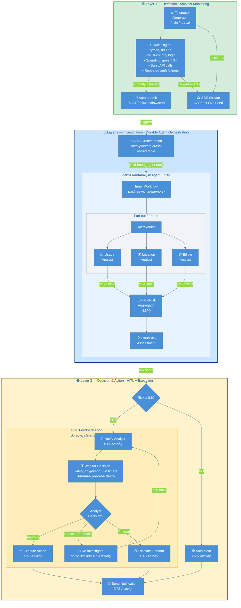

### Why This Layering?

| Layer | Uses LLM? | Durable? | Why? |
|-------|-----------|----------|------|
| **Layer 1** — Detection | ❌ No | ❌ No | Events arrive every 2–5s. An LLM call takes 2–5s and costs money. Simple rules catch 95% of benign events at zero cost. |
| **Layer 2** — Investigation | ✅ Yes | ✅ Yes (entity) | Complex multi-signal reasoning is the LLM's strength. Entity state persists the full conversation for re-investigation. |
| **Layer 3** — Decision | ❌ No | ✅ Yes (orchestration) | Human decisions can take hours/days. DTS timers and external events survive crashes and restarts. |

---

## 🔑 Key Patterns

### Pattern 1: Durability Boundaries — What Gets Checkpointed?

Not everything needs to be durable. The key architectural insight is choosing **where** to draw the durability boundary:

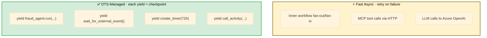

**Why not checkpoint every LLM call?** Adding DTS checkpoints to each LLM call would add ~200ms overhead per call and massively complicate the agent topology. The inner workflow runs in ~10–20s — fast enough that retry-on-failure is the right strategy. If the worker crashes mid-inner-workflow, the entity call simply retries from the beginning.

### Pattern 2: Stateful Feedback Loop via Durable Entity

The `FraudAnalysisAgent` is registered as a DTS entity (`dafx-FraudAnalysisAgent`). The entity persists conversation history via `DurableAgentState`, enabling meaningful re-investigation:

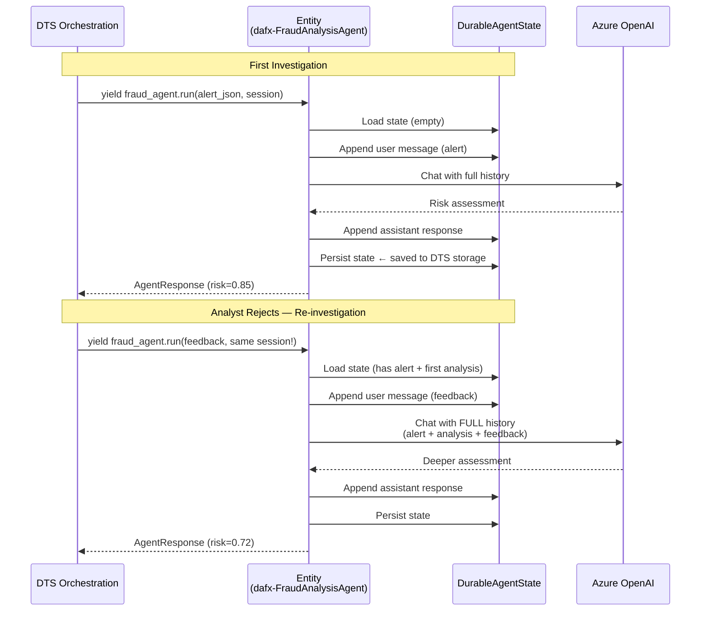

The agent doesn't start from scratch — it sees the original alert, its first analysis, AND the analyst's feedback. This is what makes re-investigation meaningful.

### Pattern 3: Ambient Detection Without LLM Overhead

Layer 1 uses fast Python rule evaluation, not LLM inference:

```python
# Rule: Multi-country login within 2 hours
if event.type == "login" and event.country != last_login_country:
    if time_delta < timedelta(hours=2):
        trigger_alert(event)  # → Layer 2 DTS orchestration

# Rule: Spending spike > 3× average
if event.type == "transaction" and event.amount > 3 * customer_average:
    trigger_alert(event)
```

At 1 event every 2–5 seconds, an LLM call (2–5s each) can't keep up. Rules handle the 95% of benign events at zero cost. The LLM's value is in Layer 2, where it reasons about complex multi-signal patterns.

### Pattern 4: Backend-For-Frontend (BFF) for Durable Workflows

The browser cannot call DTS's gRPC SDK directly. The FastAPI backend translates REST/WebSocket into SDK calls:

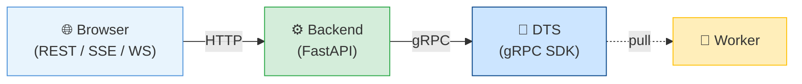

In production, swap `DTS_ENDPOINT` from `localhost:8080` to your Azure DTS endpoint. **Zero code changes.** See [PRODUCTION_ARCHITECTURE.md](PRODUCTION_ARCHITECTURE.md).

---

## 🛡️ Why Is This Actually Durable? — Deep Dive

This section explains the **concrete mechanics** that make this architecture truly durable, not just the claim. Understanding these internals is critical for the workshop.

### The Durability Stack

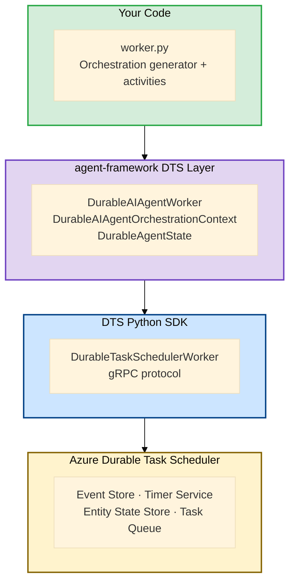

### 1. Event Sourcing — Checkpoints via `yield`

Every `yield` in the orchestration generator is a **checkpoint written to DTS's event store**:

```python
# Each yield writes an event to DTS's append-only log
response = yield fraud_agent.run(messages=alert, session=session)  # ← checkpoint
yield context.call_activity("notify_analyst", input=assessment)     # ← checkpoint
winner = yield when_any([wait_for_event(...), create_timer(72h)])    # ← checkpoint
```

These aren't in-memory variables — they're **persisted facts** in DTS storage. If the process crashes after step 2, DTS knows steps 1 and 2 completed because their completion events exist in the log.

### 2. Replay, Not Restore — How Crash Recovery Works

When a worker restarts after a crash, it doesn't "load state" — it **replays the orchestration function from the beginning**, but with a twist:

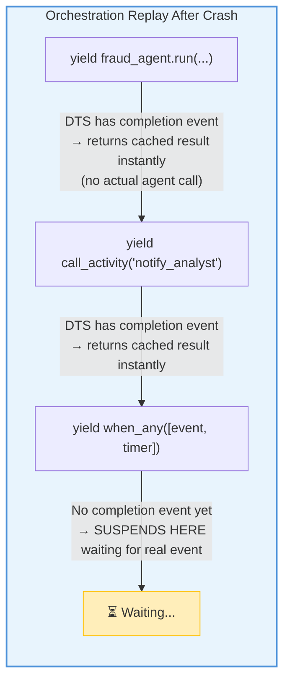

The generator function re-executes, but each `yield` that already completed **returns its cached result instantly** without re-executing the actual work. The orchestration replays forward until it reaches the first incomplete step, then suspends. This is why your orchestration code must be **deterministic** — it's replayed, not restored.

### 3. External Events Survive Process Death

The `wait_for_external_event("AnalystDecision")` call is especially powerful:

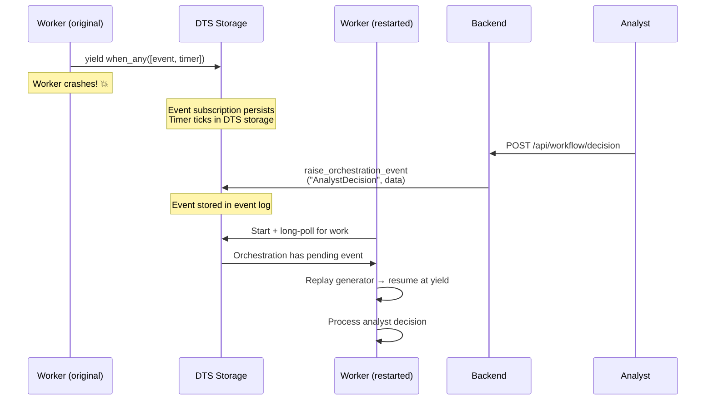

The event subscription, the timer countdown, and the eventual analyst response — **all live in DTS storage**, not in the worker's memory. The worker is just a stateless compute runtime that pulls work.

### 4. The Worker Is Stateless — All State Lives in DTS

This is the fundamental insight. The worker process holds **zero durable state**:

| What | Where It Lives | Survives Crash? |
|------|---------------|-----------------|
| Orchestration progress (which step) | DTS event log | ✅ Yes |
| Agent conversation history | DTS entity state (`DurableAgentState`) | ✅ Yes |
| Pending timers (72h analyst timeout) | DTS timer service | ✅ Yes |
| External event subscriptions | DTS event store | ✅ Yes |
| Activity results | DTS event log | ✅ Yes |
| In-flight LLM call | Worker memory | ❌ No (retried) |
| In-flight MCP tool call | Worker memory | ❌ No (retried) |

When the worker crashes, the only things lost are in-flight LLM/MCP calls — and those are inside the inner workflow, which retries as a unit when the entity operation is re-dispatched.

### 5. Entity State Persistence (`DurableAgentState`)

The `agent-framework` library stores the full agent conversation in a structured schema:

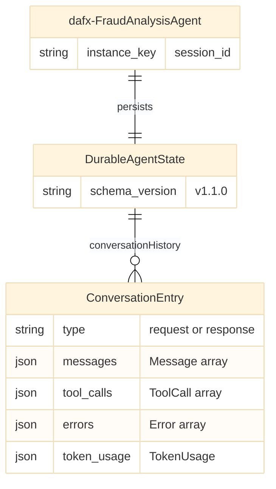

Every time the entity processes a request, the cycle is:
1. **Load** state from DTS → `DurableAgentState`
2. **Append** user message (alert or feedback)
3. **Rebuild** full chat history from all entries (filtering out errors)
4. **Call** LLM with complete conversation
5. **Append** assistant response
6. **Persist** state back to DTS via `self.persist_state()`

This is why the agent can re-investigate with full context — the conversation history is a **durable, append-only log** stored in DTS, not in worker memory.

### 6. What DTS Provides vs. What It Doesn't

Understanding the **scope boundary** is critical:

```mermaid
%%{init: {'theme': 'base'}}%%
flowchart LR
    subgraph DTS_SCOPE["🔷 DTS Provides"]
        direction TB
        DS1["Persistent task queue"]
        DS2["Event store · append-only log"]
        DS3["Timer service"]
        DS4["Entity state storage"]
        DS5["Work item distribution"]
        DS6["At-least-once delivery"]
    end

    subgraph WORKER_SCOPE["🔧 Worker Provides"]
        direction TB
        WS1["Compute runtime · Python"]
        WS2["LLM calls · Azure OpenAI"]
        WS3["MCP tool calls · HTTP"]
        WS4["Business logic · orchestration"]
        WS5["Agent framework integration"]
    end

    DTS_SCOPE ~~~ WORKER_SCOPE

    style DTS_SCOPE fill:#cce5ff,stroke:#004085,stroke-width:2px
    style WORKER_SCOPE fill:#ffeeba,stroke:#ffc107,stroke-width:2px
```

DTS is a **persistent task queue + event store + timer service**. It doesn't run your code — it stores the _record of what happened_ and _dispatches work items_ to workers. The worker is a **stateless compute runtime** that pulls tasks, executes your Python/LLM/MCP logic, and reports results back. If the worker dies, DTS still has the full event log; a new worker replays it and picks up where things left off.

---

## 📁 Project Structure

```
fraud_detection_durable/
├── worker.py                       # DTS Worker: orchestration + agent entity + activities
├── backend.py                      # FastAPI BFF: REST API, WebSocket, SSE, event producer
├── event_producer.py               # Layer 1: telemetry generation + anomaly detection
├── fraud_analysis_workflow.py      # Inner workflow: fan-out → aggregate (Layer 2)
├── provision_dts.ps1               # Azure DTS provisioning script
├── .env                            # Configuration (Azure OpenAI, DTS, App Insights)
├── pyproject.toml                  # Dependencies
├── README.md                       # This file
├── PRODUCTION_ARCHITECTURE.md      # Production deployment on Azure Container Apps
└── ui/                             # React/Vite UI
    ├── src/
    │   ├── App.jsx                 # Main app: WebSocket + SSE connections
    │   └── components/
    │       ├── ControlPanel.jsx    # Alert selector + start button
    │       ├── WorkflowVisualizer.jsx  # React Flow DAG visualization
    │       ├── AnalystDecisionPanel.jsx  # HITL approve/reject/feedback
    │       └── EventFeed.jsx       # Live telemetry feed (Layer 1)
    └── package.json
```

---

## 🚀 Quick Start

### Prerequisites

- **Docker** — for DTS emulator
- **Python 3.12+** with **uv**
- **Node.js 18+** — for React UI
- **Azure OpenAI** — with a deployed chat model
- **MCP Server** — Contoso tools on port 8000

### Service Startup

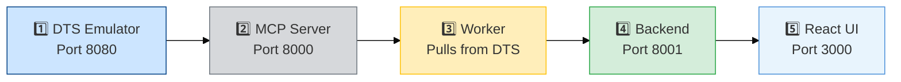

#### 1. Start DTS Emulator

```bash
docker run -d --name dts-emulator \
  -p 8080:8080 -p 8082:8082 \
  mcr.microsoft.com/dts/dts-emulator:latest
```

Dashboard: http://localhost:8082

> **Production:** Replace with Azure DTS — same SDK, just change `DTS_ENDPOINT`. See [provision_dts.ps1](provision_dts.ps1).

#### 2. Start MCP Server

```bash
cd mcp && uv run python mcp_service.py
```

#### 3. Start Worker

```bash
cd agentic_ai/workflow/fraud_detection_durable
uv sync && uv run python worker.py
```

#### 4. Start Backend

```bash
uv run python backend.py
```

#### 5. Start React UI

```bash
cd ui && npm install && npm run dev
# Open http://localhost:3000
```

---

## 🧪 Demo Scenarios

### Scenario 1: Ambient Detection → Auto-Clear

Watch the event feed — a multi-country login anomaly triggers automatic investigation. Low risk → auto-cleared.

### Scenario 2: Ambient Detection → HITL Approval

A spending spike triggers investigation. High risk → analyst reviews → approves "lock account".

### Scenario 3: Reject → Stateful Re-investigation

Analyst rejects with feedback "check if VPN usage". Agent re-investigates with **full conversation history** (original alert + first analysis + analyst feedback).

### Scenario 4: Kill & Recover (Durability Proof) 💥

This is the most important demo — it proves the architecture isn't just theoretical:

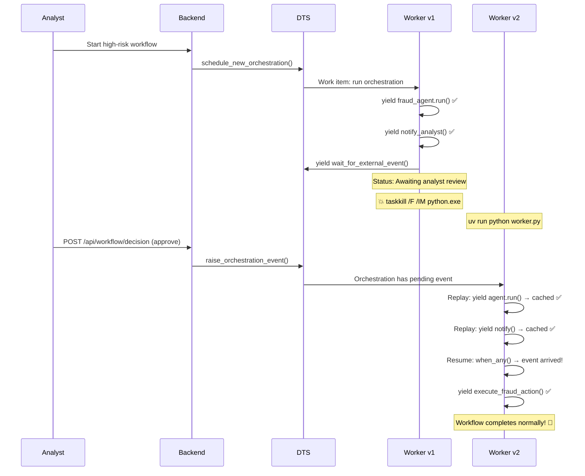

1. Start a high-risk workflow → reaches "Awaiting analyst review"
2. `taskkill /F /IM python.exe` — kill all Python processes
3. `uv run python worker.py` — restart the worker
4. Submit analyst decision via UI
5. **Workflow completes normally** — DTS replayed the orchestration from its event log ✅

---

## 🔧 Configuration

| Variable | Description | Default |
|----------|-------------|---------|
| `AZURE_OPENAI_ENDPOINT` | Azure OpenAI endpoint | Required |
| `AZURE_OPENAI_CHAT_DEPLOYMENT` | Model deployment name | `gpt-4o` |
| `MCP_SERVER_URI` | MCP server URL | `http://localhost:8000/mcp` |
| `DTS_ENDPOINT` | DTS endpoint (local or Azure) | `http://localhost:8080` |
| `DTS_TASKHUB` | DTS task hub name | `default` |
| `ANALYST_APPROVAL_TIMEOUT_HOURS` | HITL timeout | `72` |
| `MAX_REVIEW_ATTEMPTS` | Max reject → re-investigate cycles | `3` |
| `EVENT_PRODUCER_ENABLED` | Enable Layer 1 event producer | `true` |
| `EVENT_INTERVAL_SECONDS` | Seconds between telemetry events | `3` |
| `BACKEND_OBSERVABILITY` | Enable Application Insights | `false` |

---

## 📐 Production Deployment

For Azure Container Apps deployment topology, security with Managed Identity, KEDA scaling, and cost estimation, see:

👉 **[PRODUCTION_ARCHITECTURE.md](PRODUCTION_ARCHITECTURE.md)**

---

*Copyright (c) Microsoft. All rights reserved.*
